# Chapter 2 Data Preparation using Data Refinery

## 2.1 Introduction to Data Refinery

IBM Data Refinery, first released in November 2017, is part of the Watson Data Platform integrated environment and is a self-service data preparation client for data scientists, data engineers, and business analysts. With it, you can quickly transform large amounts of raw data into consumable, quality information that’s ready for analytics. IBM Data Refinery makes it easy to explore, prepare, and deliver data that people across your organization can trust. It provides:

- Ability to access data wherever it resides (in the cloud, on-premises, or on your desktop)
- Powerful shaping operations to clean, organize, fix, and validate data
- Scripting support for RStudio’s dplyr for the efficient and flexible manipulation of data sets
-Support for single- and multi-column operations and the creation of complex new columns from existing columns
- Ability to undo, redo, and delete steps in a data flow
- Monitoring of data preparation flows
- Interactive data validation and automatic detection of anomalies such as missing values, outliers, and duplicates
- Visualizations that provide insight into large amounts of data

When refining your data, the **Data** tab is where you can see a simple of how you data looks and see the result of any operation you select to do on your data. The **Profile** tab allows you to see a summary of some basic statistical analysis and can be used to find anomalies. The **Visualizations** tab helps with getting insights into your data.

## 2.2 Prerequisites

- You should have a empty project (We named it Watson Studio Workshop as an example) created in Watson Studio. If you don’t have one, read how to create an new project here(Link to Intro) starting Step 5.

- Download sample *data adult_person_info.csv* and *adult_org_info.csv* for this lab [here] or if you have the WatsonsStudioWorkshop.zip file provided by the instructor, the data will be reside in WatsonsStudioWorkshop/01-Data Preparation in Data Refinery.

## 2.3 Add Datasets to the Project

1. Go to the newly created **Watson Stutido Workshop** project and add the datasets to the project:

- Click on **Assets** on the panel found under the name of your project at the top of the page.
- At the top right of the page, click on the icon that has zeros and ones (two of each).
- Click on **Load** and drag and drop the two files *adult_person_info.csv* and *adult_org_info.csv*.
- You will notice that once the files are uploaded, they will be added under Data assets.

Adding data assets

2. Review Data Refinery UI:

- Go to the triple dot menu next to next to *adult_person_info.csv* under *Data assets* and select **Refine**. This will open a page that shows a sample of the content, where you can start cleaning and reshaping the data set.
- On the panel on the right, you will find **Details** including the project the data asset belongs to, and description of the resulting data set we will get after the refining process. Close it for the time being.
- Click on **Steps**, which you can find right hand-side of the page. This is where you will see each operation you will define while transforming the data. It shows the data flow defining the operations to be done on the entire data set.

Data tab

3. You may notice that an auto data type conversion step has been applied, in order to practice how to mannually convert column type, we will remove this step for now by clicking on the trash bin icon.

Remove Convert Column Type
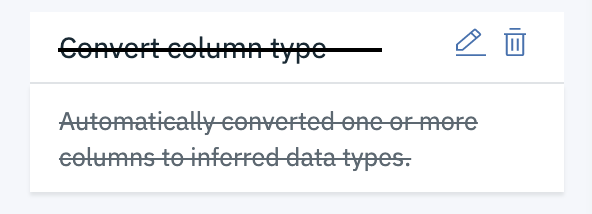

## 3.4 Review Data Profile

4. Skim through data displayed in the **Data** tab and then click on the **Profile** tab and take a quick look at data summary and get a feel of you data. You will notice some weird values under **FREQUENCY** for some fields. For example, you will notice that:

- Some values under **AGE** contain additional string such as “years old”,
- For **Education**, there are some additional values with extra spaces at the beginning and possibly the end of the string,
- Empty cells in the **OCCUPATION** column,
- and there are multiple values under **GENDER** that seem to be meant to represent the value Male, etc.

That’s why our data needs to be cleaned.
Profile tab

## 3.5 Data Harmonization: AGE

5. Standardize the AGE field:

- As mentioned eariler, you will notice some values with additional string such as years old. What we want is to just retain the numerical part, which can only be a two-digit number in our case (we know there are no additional characters that were added before the numerical part of the values or that the digits contain no weird characters).

Harmonization data in the AGE field

- Click on **+Operation** and select **Split column**, which you can find under **ORGANIZE**.
- Choose AGE as the **Selected column**.
- Under **POSITION** tab, type 2 in the **Positions** field and <AGE_num,AGE_str> in the **Names of new columns**. Make sure to unselect **Keep original column**
- Click **Apply**.

Bear in mind that this is not the best approach to handle this. This is just provide an example of how to use the **split column** operation.

Harmonization data in the AGE field 2

- Go to the **Data** tab and remove the newly created column called *AGE_str*, which only contain the string part of the age.

Remove AGE_str

- Go to column called *AGE_num* and rename it to *AGE* by clicking on the little pencil icon.
- Go to the **Profile** tab again to for a final check.

## 3.6 Convert Data Type

6. Change **AGE** data type to **Integer** by clicking on the triple dots, then CONVERT COLUMN…> Integer. Data Refinery will put a dot in front of the recommended data type.

Convert data type
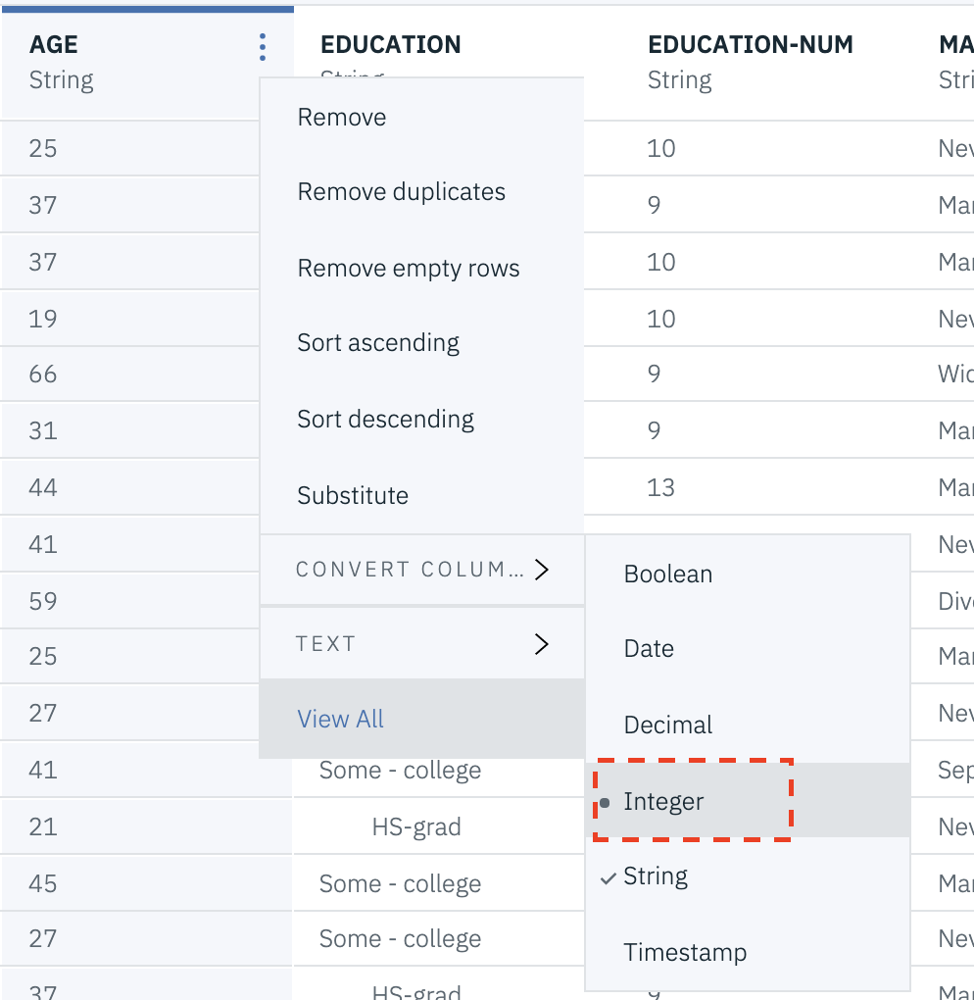

## 3.7 Data Harmonization: EDUCATION

7. Standardize the *AGE* field:

- Click on the **Profile** tab and take a closer look at the column *EDUCATION*. You notice there are some additional values with extra spaces at the beginning and possibly the end of the string.

Harmonization data in the EDUCATION field
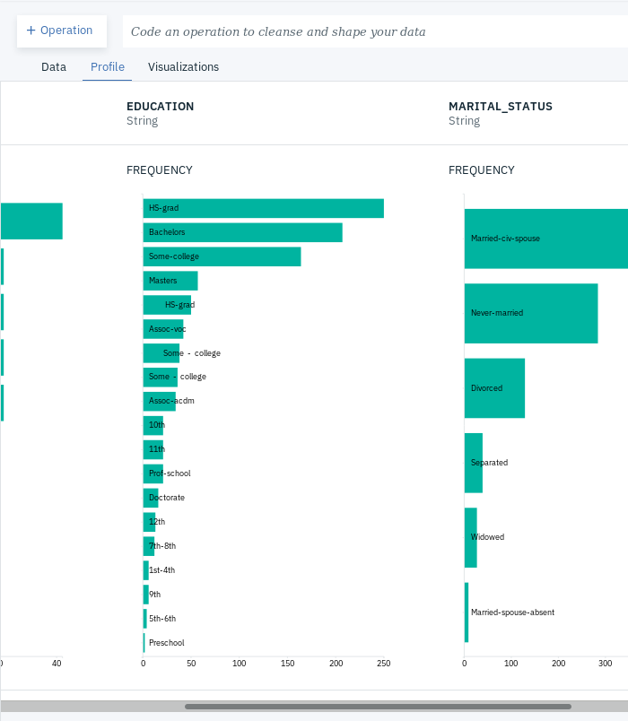

- Click on **+Operation** and select **Text**, which you can find under **FREQUENTLY USED**.
- Choose *EDUCATION* as the **Selected column**, **Collapse spaces** as the **Text Operation**.
- Click **Apply** and go to the **Profile** tab again to check if all the additional values have been removing. You will notice the we still have Some - college as an additional value, which we want to harmonize and change to *Some-college*.

Harmonization data in the EDUCATION field 2
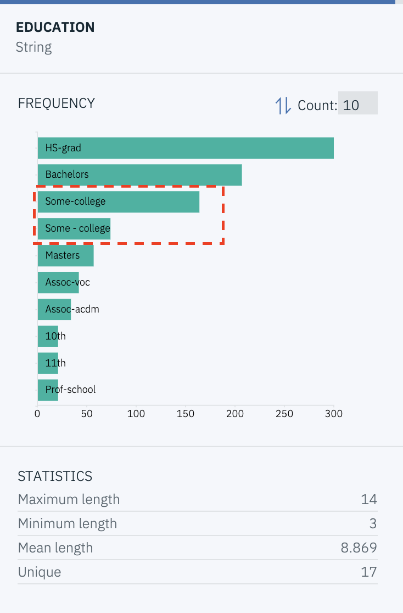

- Click on **+Operation** and select **Replace substring**, which you can find under **CLEANSE**.
- Choose *EDUCATION* as the **Selected column**.
- Under **TEXT** tab, type Some - college in **Value** field and Some-college in the *Enter the replacement string*. Make sure to select **Replace all occurrences**
- Click **Apply**.

Harmonization data in the EDUCATION field 3
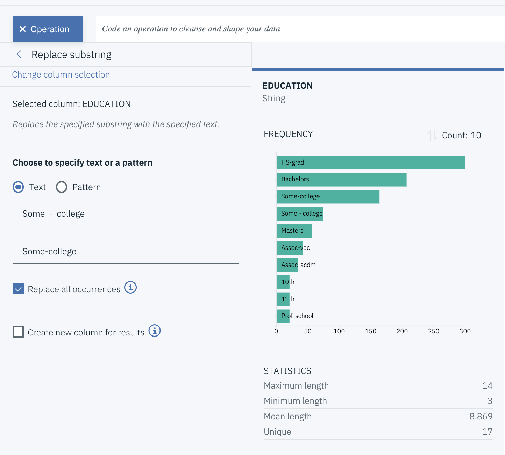

- We also want to convert all values in the EDUCATION column to lower case. So, click on **+Operation** and select **Text**, which you can find under **FREQUENTLY USED**.
- Choose EDUCATION as the **Selected column**, **Lower case** as the **Text Operation**.
- Click **Apply** and go to the **Profile** tab again to for a final check.

Harmonization data in the EDUCATION field 4

## 3.8 Remove Missing Values in OCCUPATION

8. Removing empty rows (List-wise deletion):

- Go to the **Data** tab.
- Go to the column called OCCUPATION and remove rows with any empty values by clicking on the triple dot menu next to the column name and selecting **Remove empty rows**.

Removing empty rows
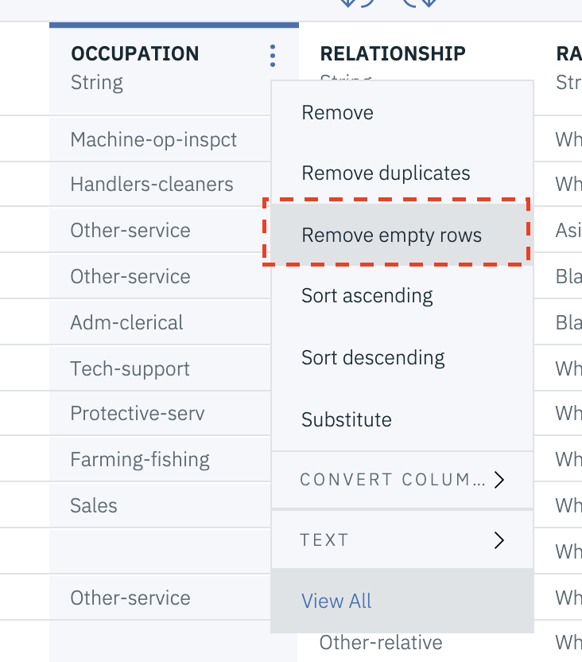

- Go to the **Profile** tab to check if all empty values have been remove for OCCUPATION.

Note that you will typically try to understand the different reasons behind having missing values and act accordingly. Some of the techniques used in such situations may include:

- Using deletion methods such as:
  - List-wise deletion
  - pairwise deletion
- Single imputation methods such as:
  - Mean/Mode substitution
  - Regression Imputation
- Model-based methods such as:
  - Maximum Likelihood
  - Multiple Imputation

## 3.9 Data Harmonization: GENDER

9. Standardize the GENDER field:

- Click on the **Profile** tab and take a closer look at the column *GENDER*. You will notice some additional values other than Male and Female, mainly ones that we want to change to Male.

Harmonization data in the SEX field
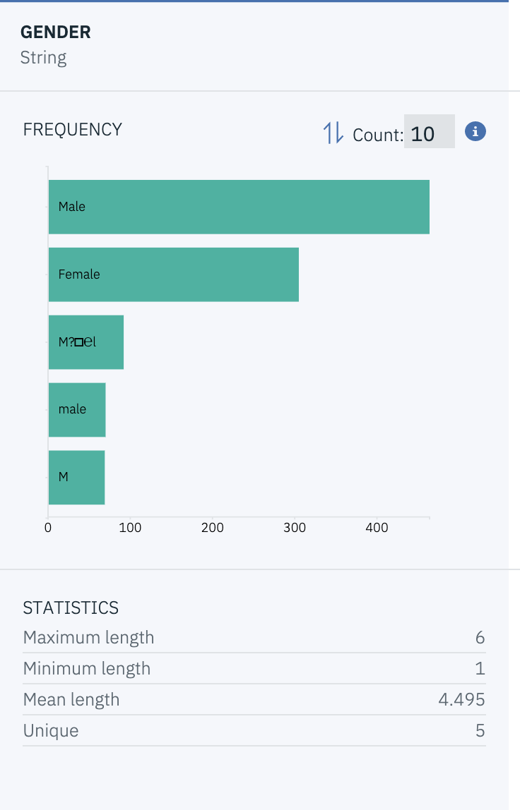

- Click on **+Operation** and select **Replace substring**, which you can find under **CLEANSE**.
- Choose **GENDER** as the *Selected column*.
- Under **PATTERN** tab, type <^(?!(Male|Female))([Mm].*)> in the **Regular expression** field and Male* under **Enter the replacement string**. Make sure to select **Replace all occurrences**.

What is meant by ^(?!(Male|Female))([Mm].) is to find any expression that doesn’t start with Male* or Female and starts with the letter M or m, which could be followed by any character.

regex

- Click Apply and go to the Profile tab again to for a final check.

Harmonization data in the GENDER field 2
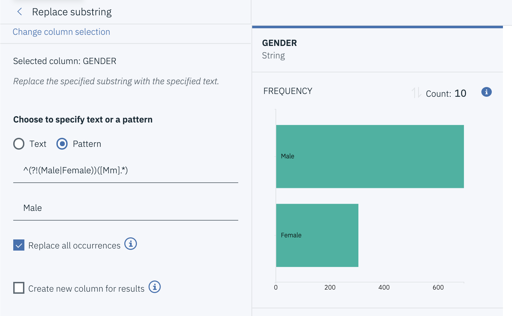

## 3.10 Remove Duplicates

10. Remove duplicate values based on the UNIQUE_ID:

- Go to the **Data** tab.
- Go to the column called *UNIQUE_ID* and remove rows with any duplicate UNIQUE_ID values by clicking on the triple dot menu next to the column name and selecting **Remove duplicates**.

Remove duplicate values based on the UNIQUE_ID

## 3.11 Join Datasets

11. Now we will join two datasets:

- Click on the **Data** tab to see a sample of your data.
- Click on **+Operation** and then select **Join**, which you can find under **ORGANIZE**. This is to join both the data assets we added namely the one we are currently refining, *adult_person_info.csv*, and *adult_org_info.csv*.

Join
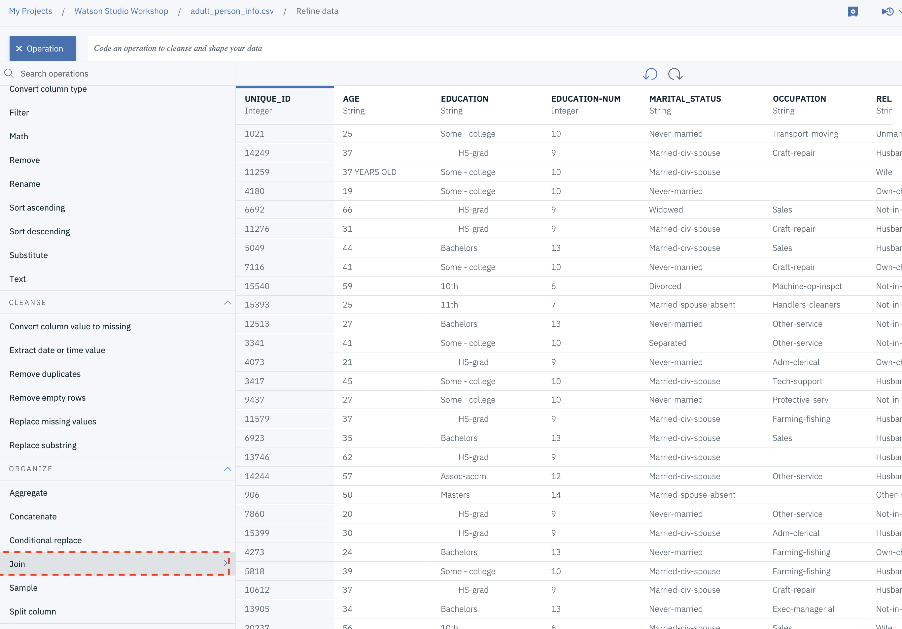

PS: Make sure UNIQUE_ID for both datasets are either String or Integer format to sync

- Select **Inner join** as the method of how we want our data to be combined (Inner Join selects records that have matching column value(s) in both tables). By default, the **Source** is selected as the current data asset (*adult_person_info.csv*).

- Choose *adult_org_info.csv* as the **Data set to join**. Click on the little eye icon to preview data, you will find it has a column **UNIQUE_ID** which is our join key. Click **Apply**.

Data preview
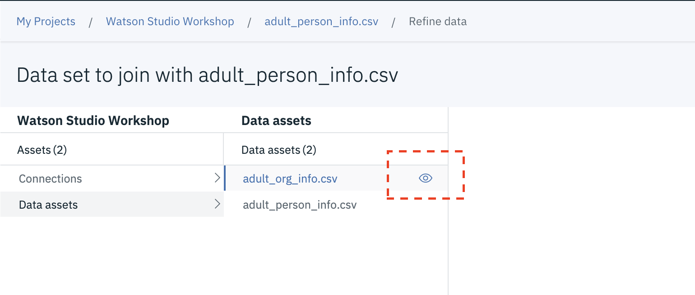

- Use the default values for the **Suffix** field, which is just a way for you to differentiate any duplicate fields resulted during the joining process. You can also modify it if you want.

- For the **JOIN KEYS**, select UNIQUE_ID representing the employee ID, as the join key for both data sets and click **Next**

Joining two data sets
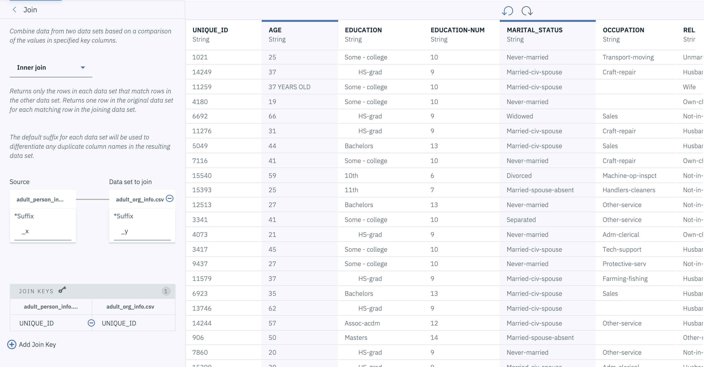

- Keep all columns and select **Apply**.

Keep all columns
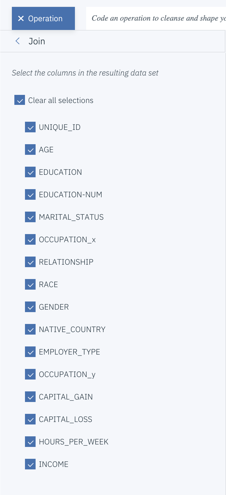

12. We will notice that there are 2 columns representing **OCCUPATION**, one coming from each of the data sets. Let’s check to see if they contain the exact same values.

- Click on **+Operation** and select **Calculate**, which you can find under FREQUENTLY USED.
- Choose OCCUPATION_x as the Selected column, Is equal to as the Operation and OCCUPATION_y as the COLUMN.
- Select to Create new column for the results and enter **“OCCUPATION_CHECK”** as the New column name.
- Click **Apply**. You will see the resulting column added at the right end of the table.

Create a new column for OCCUPATION_CHECK

13. Count OCCUPATION_CHECK:

- In the space next to the **+Operation button**, place the cursor and select **count**.
- Click on the count that was added to the box and select count(<column>).
- Click on and choose the newly created column (we called it OCCUPATION_CHECK).
- Click **Apply**.

Count OCCUPATION_CHECK

14. The result shows that OCCUPATION_x and OCCUPATION_y have identical values.

Check Results

## 3.12 Undo Steps

15. So we can just keep one of them and keep one OCCUPATION column:

- Go back **2 steps** by either clicking on the Undo shaped button found at the top middle of the page or by going to the step added under **Steps** and clicking on the bin icon. Whichever way you select, you will need to do it **twice**.

Delete steps

- Go to column called *OCCUPATION_x* and rename it to *OCCUPATION* by clicking on the pencil shaped icon next to the column name.

Rename OCCUPATION

- Go to column called *OCCUPATION_y* and remove by clicking on the triple dot menu next to the column name and selecting **Remove**.

Remove OCCUPATION_y

 

## 3.13 Data Visualization

Data Refinery does not only include powerful shaping operations to clean, organize, fix, and validate data but also has built-in visualization capblities to derive insights from data.

16. Click on the **Visualization Tab**, choose **OCCUPATION** from the dropdown menu, then click **Visualize Data**.

Visualize OCCUPATION
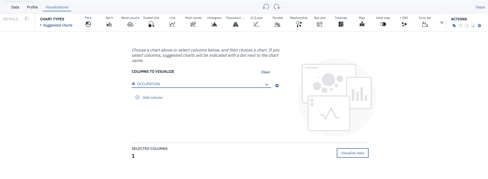

17. Data Refinery will recommend the best techniques to visulize the data. For OCCUPATION, it recommended the pie chart showing you the distribution of OCCUPATION. Click on other **CHART TYPES** to see other other visulization outputs if interested.

Pie Chart
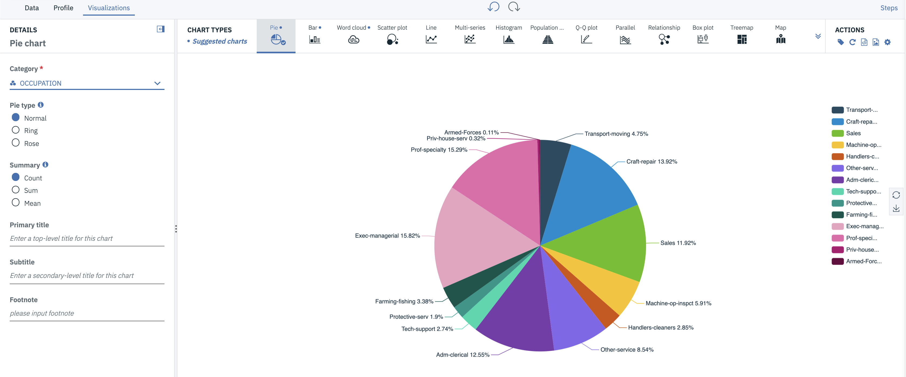

## 3.14 Save and Run the Data Flow

18. Let’s say our data preparation effort is complete and you want to run the data flow. Click on the button on the top right corner, choose **Save and create job**.

Running the data flow
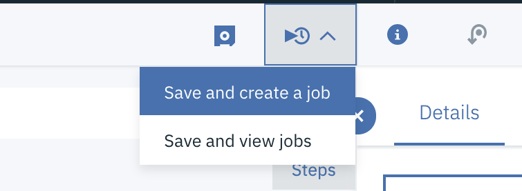

19. This will take you to a page where you will need to configure the Data Refinery flow details (the stream) and the Data Refinery Flow output (a file). Give the job a name(We named it Data Preparation) and keep the rest as it is. Click **Create** and **Run**.

Create a job

20. Note that if you click on the **Add Schedule** button, you will have the ability to schedule your data preparation, which is very useful if you do these steps on dynamic data.

For Dynamic Data
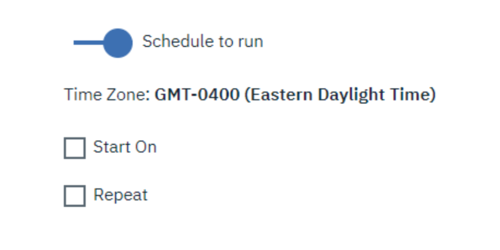

21. At this point, you should see a status on your data preparation job.

Job status

22. If you go back to the **Assets** page of your project (by clicking on My Projects > Watson Studio Workshop), you will notice that the new csv file has been added as a new data asset. You can also find the data flow you have created if you scroll down to the end of the same page. Note that you can refine your data flow at any time by clicking on the triple dot menu next to the data flow name.

Data Refineary outputs
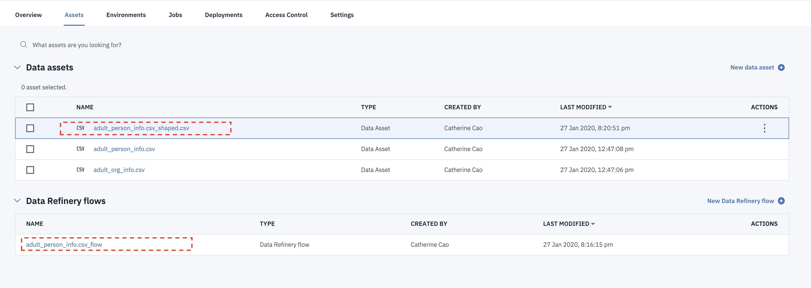

**You now know how to profile, prepare and analyze your data in Watson Studio using Data Refinery. These data flows can be shared, edited and scheduled!**