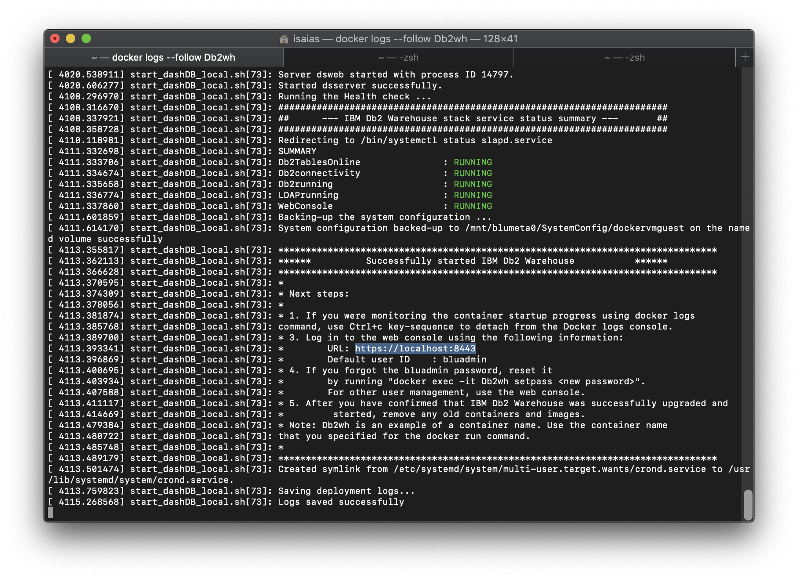
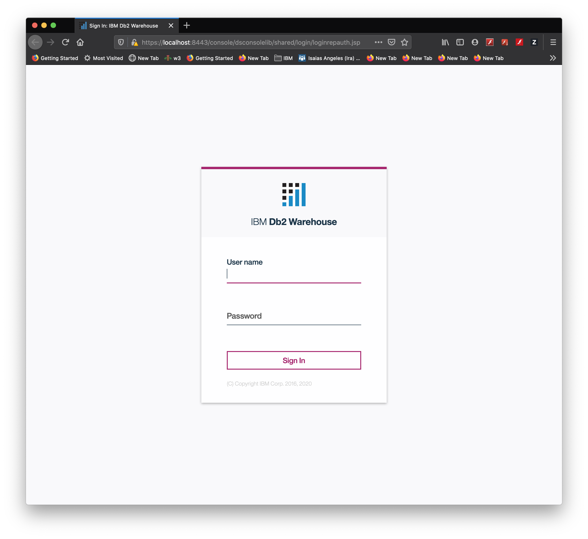
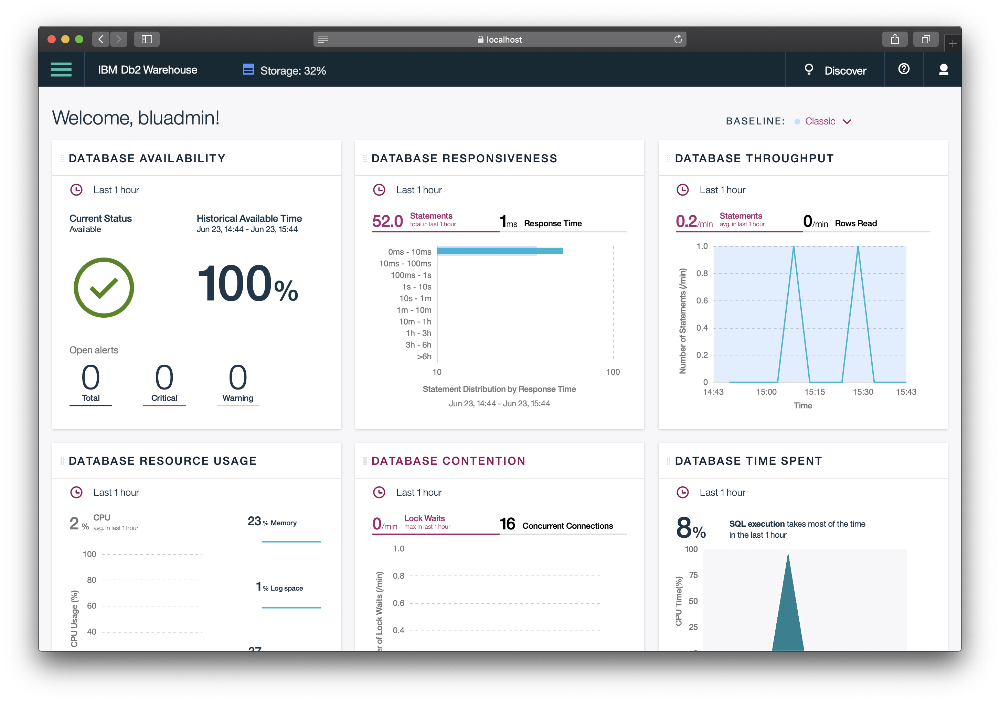

# DB2 Warehouse

## Set up local DB2 Warehouse

1. Deploy on local Hardware

    * [For Windwos or Mac system](https://www.ibm.com/support/knowledgecenter/en/SSCJDQ/com.ibm.swg.im.dashdb.doc/admin/deploy_own_hw.html)
    * [For Linux and other platforms](https://www.ibm.com/support/knowledgecenter/en/SSCJDQ/com.ibm.swg.im.dashdb.doc/admin/deploy_own_hw.html)

2. Verify status of the deployment by using the command

```
    docker logs --follow Db2wh
```

3. Check for the following results:

    

4. Upon successfull deployment open in browser **https://localhost:8443**

5. Login as **bludadmin** with the set password

    

6. Dashboard upon successful login

    


