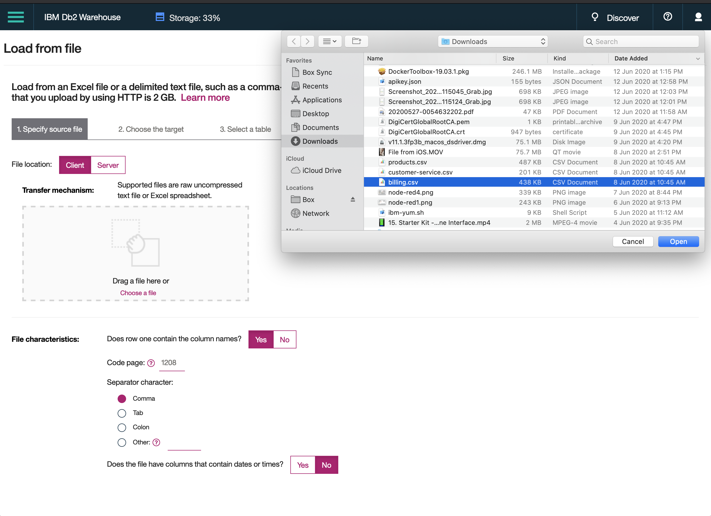
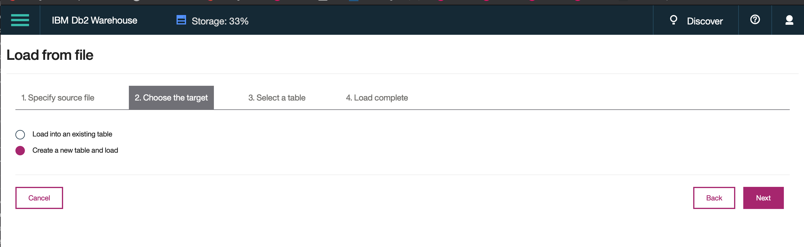
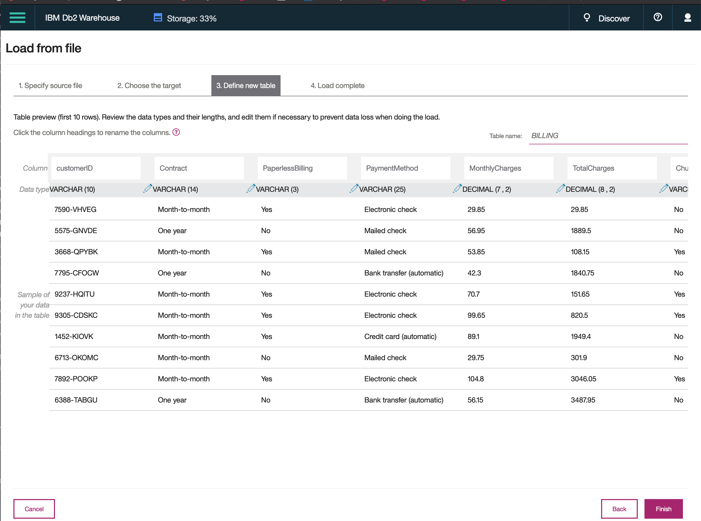
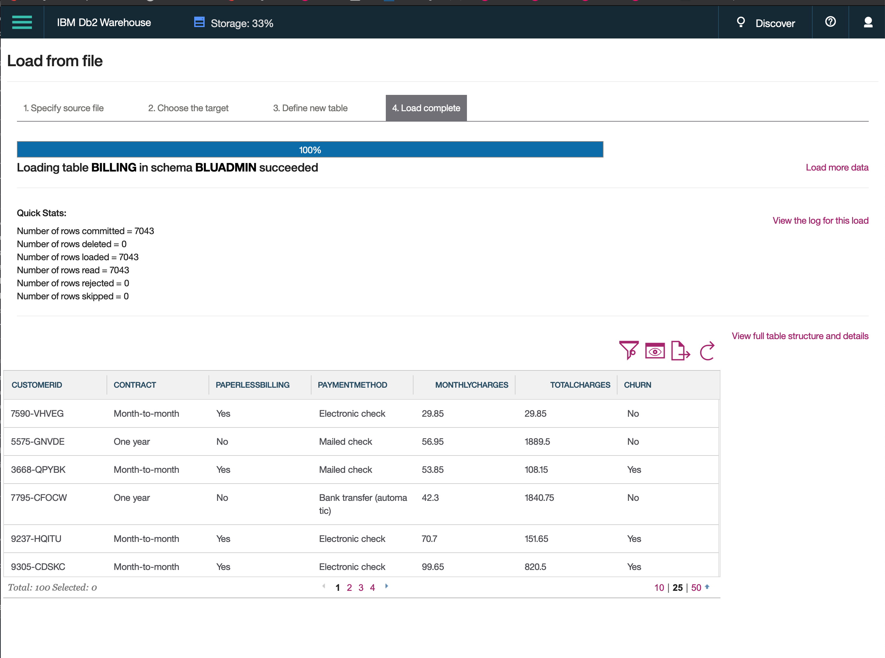

# DB2 Warehouse

## Load Data 

1. Download the following files from this Github [repository](https://github.com/IraAngeles-IBM/IBM-AI-Workshop-ASEAN/tree/master/cloud_pak_for_data/assets):

    - billing.csv
    - products.csv
    - customer-serivce.csv

2. Select **Load** from File in the Menu:

    

3. Select source **billing.csv** file

    

4. Choose the target, **create a new table and load**, then click **next**

    

5. Define or verify the suggested table definition, then click **Finish**

    

6. Load complete, click on **Load more Data** to load **products.csv** and **customer-service.csv**, repeating steps 2 to 6.

    

